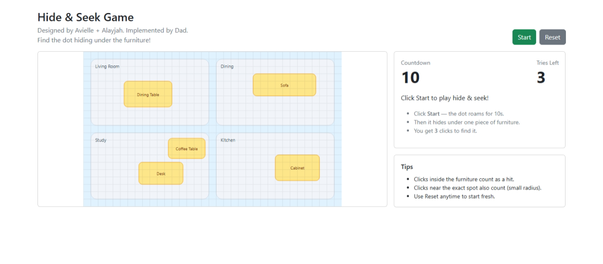

# Hide & Seek Game

**By Avielle (8), Alayjah (6), and Alfred — 2025**

A tiny web game where a dot roams around a house floor plan for 10 seconds, hides under a piece of furniture, and you get **three guesses** to find it. Built with **React + TypeScript + Vite** and styled with **Bootstrap 5**.

---

## ✨ Backstory

In 2025, while I (Alfred) was learning React, my daughters **Avielle (8)** and **Alayjah (6)** came over asking what I was doing. I asked what we should build on the internet, and because they love playing hide and seek, they said, “Let’s do hide and seek!” I then prompted **ChatGPT 5** for a rough layout and we built the game together. This repo is dedicated to them, for the idea and the smiles it created.

---

## 🎮 Gameplay

* Click **Start** → the dot moves randomly for **10 seconds**.
* After 10s, it **hides under a random furniture** item.
* You get **3 clicks** anywhere on the map to guess where it’s hiding.
* Hit inside the furniture (or near the exact hiding point) → **“Found You!”**
* Misses show a **funny message**; run out of tries and you’ll see where it was.
* Click **Reset** anytime. After a round, you’ll be prompted to play again.

---

## 🧱 Tech Stack

* **React 18** + **TypeScript**
* **Vite** (fast dev server / build)
* **Bootstrap 5** (layout and components)
* **SVG** for the floor plan and game visuals

---

## 🚀 Quick Start

```bash
# 1) Install deps
npm install

# 2) Start dev server
npm run dev

# 3) Build for production
npm run build
npm run preview
```

Open the printed local URL (usually `http://localhost:5173`).

---

## 📁 Project Structure

```
src/
  App.tsx                  # Renders the game
  main.tsx                 # Bootstraps React + imports Bootstrap CSS
  types.ts                 # Shared TS types
  utils/
    geo.ts                 # rand, clamp, pointInRect, dist
  constants/
    messages.ts            # Funny miss messages
  data/
    rooms.ts               # Room layout + board dimensions (WIDTH/HEIGHT)
  components/
    Board.tsx              # SVG board, click→guess mapping
    Controls.tsx           # Start / Reset (Bootstrap buttons)
    HUD.tsx                # Countdown, tries, status messages
    Tips.tsx               # Help card
    Room.tsx               # Room rectangle + label
    Furniture.tsx          # Furniture rectangle + label
    SvgDefs.tsx            # Tiny inline styles for SVG colors
  game/
    HideAndSeekGame.tsx    # State machine, timers, hiding logic
```

> If you’re reading this in the single‑file version, the code was later split into the structure above for maintainability.

---

## ⚙️ Configuration & Tuning

You can tweak the game difficulty and map quickly:

* **Timer (10s)** and **tries (3)**: see initial state in `game/HideAndSeekGame.tsx`:

  ```ts
  const [countdown, setCountdown] = useState<number>(10);
  const [triesLeft, setTriesLeft] = useState<number>(3);
  ```
* **Move speed / step size** and **tick rate**:

  ```ts
  const step = 22;        // how far the dot moves per tick
  setInterval(..., 180);  // movement tick interval (ms)
  ```
* **Hit radius** for "near miss counts as hit":

  ```ts
  const hitRadius = 22;   // pixels in SVG units
  ```
* **Map layout & board size**: edit `data/rooms.ts` (rooms) and `WIDTH/HEIGHT`.
* **Hiding spots (furniture)**: edit the array in `useObjects()` inside `HideAndSeekGame.tsx` (or refactor to `data/furniture.ts`).
* **Messages**: update `constants/messages.ts`.

---

## 🧩 Accessibility Notes

* The board is an `<svg>` with `role="img"` and an ARIA label.
* High‑contrast dot and clear outlines. Further improvements welcome (focus rings, keyboard guessing, narrated feedback, etc.).

---

## 🧪 Ideas & Roadmap

* Difficulty levels (shorter timer / fewer tries / faster movement)
* Sound effects & mobile haptics
* Mobile‑first layout tuning
* Heat‑hint on misses ("warmer/colder" overlay)
* Load floor plans & furniture from JSON
* Scorekeeping across rounds

---

## 🤝 Contributing

PRs welcome! If you’d like to help (especially with accessibility, animations, or new maps), please open an issue or pull request.

**Local Dev Guidelines**

* Use TypeScript and keep components small and testable.
* Prefer data‑driven rooms/furniture so kids can design new maps.
* Keep it friendly for beginners—comment tricky bits.

---

## 🙏 Credits & Acknowledgements

* **Idea & Product Co‑Design**: *Avielle (8) & Alayjah (6)* — thank you for the inspiration and creative direction ❤️
* **Dev & Integration**: *Alfred*
* **Planning Assist**: *ChatGPT 5* (prompted to outline initial approach)
* **Favicon**: from Vecteezy &#x20;
  Name: [Vecteezy\_children-playing-hide-and-seek-in-the-park\_6659237.svg](https://www.vecteezy.com/vector-art/6659237-children-playing-hide-and-seek-in-the-park) &#x20;
  By: [Muhamad Chairil Anwar](https://www.vecteezy.com/members/mimosastudio)
* **Learning Resource**: YouTube tutorial by [Programming with Mosh](https://www.youtube.com/@programmingwithmosh)

> Please ensure any third‑party assets you add follow their respective licenses.

---

## 📜 License

**MIT License** — © 2025 Alfred Ofosu & contributors.
Third‑party assets remain under their original licenses.

---

## 🖼️ Screenshots



---

## 🌐 Deployment

Any static host will do (Vercel, Netlify, GitHub Pages, Cloudflare Pages). With Vite:

```bash
npm run build
# deploy the contents of dist/
```

Happy hiding & seeking! 🎯
